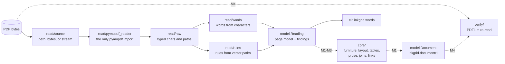

# Architecture

inkgrid is a pure core between two thin shells. The binding design is
[`specs/00-design.md`](specs/00-design.md); this page is the map.

Solid arrows exist today (M0). Dotted arrows are the later milestones.

## Layers

| package | role | may import |
|---|---|---|
| `inkgrid.model` | frozen, validated values: geometry, the page model, the `Document` contract, findings | stdlib, pydantic |
| `inkgrid.read` | the shell that reads PDFs; only `pymupdf_reader.py` imports pymupdf | `model`, pymupdf, camelot |
| `inkgrid.core` | the pipeline stages, pure functions (from M1) | `model` |
| `inkgrid.verify` | the independent re-read (from M4) | `model`, pypdfium2 |
| `inkgrid.render` | the HTML inspector (from M1) | `model`, `read` |
| `inkgrid.api` | `read_pages` (and `read`, `verify` later) | `model`, `core`, `read`, `verify` |
| `inkgrid.cli` | the `inkgrid` command | `api`, `render`, `model` |

`tests/test_architecture.py` checks every import against this table. Because `verify` may not import
`core`, the verifier cannot reuse the builder's reasoning, so agreement between them is evidence.

## The contracts

- **`Reading` (`inkgrid.reading/1`)**: what the text layer states. Pages with their words, drawn
  rules, and measurements (hidden, clipped, unmapped, and invisible characters, and the share of the
  page that images cover), plus findings. Word ids run densely from 0 across pages.
- **`Document` (`inkgrid.document/1`)**: blocks in reading order, links, findings, and a ledger. Its
  validators prove the word partition, check that block and cell text spell their words in order,
  re-derive every key and printed label from the text, and check that cells tile their grid exactly. Construction fails on any violation, so a
  `Document` that exists holds its guarantees.

Both publish a JSON Schema in [`schema/`](schema/), regenerated by `scripts/export_schemas.py` and
pinned by a test.

## Reading a page (M0)

1. `get_text("rawdict")` runs with CID fallback, ligature preservation, and image data off, so an
   unmapped glyph reads as U+FFFD instead of a guess.
2. Words are rebuilt from characters. A word continues across a span boundary only with no gap, the
   same superscript and hidden state, and real vertical overlap. Text is hidden when it is neither
   filled nor stroked (render modes 3 and 7) or fully transparent. For render modes 4-6, MuPDF also
   reports a clip copy of the drawn text, and that copy is dropped so each character is read once.
3. Rules come from stroked lines, thin rectangles, and the edges of stroked cell rectangles.
4. A second, unclipped extraction counts the characters that the clip paths and the CropBox hide.
5. Measurements become findings:
   - `unreadable_page`: a page that cannot be decoded, or declared pages that cannot be loaded;
   - `no_text_layer` or `blank_page`;
   - `partial_text_layer`;
   - `ocr_text_layer` or `hidden_text`;
   - `clipped_text`;
   - `type3_font`;
   - MuPDF's own warnings, pinned to the page that raised them.

   A page with no words is `blank_page` only when nothing on it suggests lost text: no image, no
   curves, no warnings, and no decoding error.

MuPDF's console output is silenced around each read and its display settings restored afterwards.
PyMuPDF is not thread-safe, so parallelize across processes.
