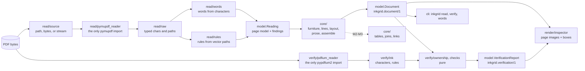

# Architecture

inkgrid is a pure core between two thin shells. The binding design is
[`specs/00-design.md`](specs/00-design.md); this page is the map.

## Layers

| package | role | may import |
|---|---|---|
| `inkgrid.model` | frozen, validated values: geometry, the page model, the `Document` contract, findings | stdlib, pydantic |
| `inkgrid.read` | the shell that reads PDFs; only `pymupdf_reader.py` imports pymupdf, and only `camelot_reader.py` camelot | `model`, pymupdf, camelot |
| `inkgrid.core` | the pipeline stages, pure functions | `model` |
| `inkgrid.verify` | the independent re-read; only `pdfium_reader.py` imports pypdfium2 | `model`, pypdfium2 |
| `inkgrid.render` | the HTML inspector | `model`, `read` |
| `inkgrid.api` | `read`, `read_pages`, and `verify` | `model`, `core`, `read`, `verify` |
| `inkgrid.cli` | the `inkgrid` command | `api`, `render`, `model` |

`tests/test_architecture.py` checks every import against this table. Because `verify` may not import
`core`, the verifier cannot reuse the builder's reasoning, so agreement between them is evidence.

## The contracts

- **`Reading` (`inkgrid.reading/1`)**: what the text layer states. Pages with their words, drawn
  rules, and measurements (hidden, clipped, unmapped, and invisible characters, and the share of the
  page that images cover), plus findings. Word ids run densely from 0 across pages.
- **`Document` (`inkgrid.document/1`)**: blocks in reading order, links, findings, and a ledger. Its
  validators prove the word partition, check that block and cell text spell their words in order,
  re-derive every key and printed label from the text, and check that cells tile their grid exactly. Construction fails on any violation, so a
  `Document` that exists holds its guarantees.

- **`VerificationReport` (`inkgrid.verification/1`)**: a document graded against its PDF. Each page's
  status (verified, declared, or unverified) and where each of its ink characters went, and the
  defects and advisories, each pinned to a page, block, cell, and box. Its validators prove that
  every page accounts for all of its ink.

All three publish a JSON Schema in [`schema/`](schema/), regenerated by `scripts/export_schemas.py`
and pinned by a test.

## Reading a page (M0)

1. `get_text("rawdict")` runs with CID fallback, ligature preservation, and image data off, so an
   unmapped glyph reads as U+FFFD instead of a guess.
2. Words are rebuilt from characters. A word continues across a span boundary only with no gap, the
   same superscript and hidden state, and real vertical overlap. Text is hidden when it is neither
   filled nor stroked (render modes 3 and 7) or fully transparent. For render modes 4-6, MuPDF also
   reports a clip copy of the drawn text, and that copy is dropped so each character is read once.
   A word drawn again at the same place (a banner painted twice, stroke then fill) is read once too,
   and its copy's characters counted.
3. Rules come from stroked lines, thin rectangles, and the edges of stroked cell rectangles.
4. A second, unclipped extraction counts the characters that the clip paths and the CropBox hide.
5. Measurements become findings:
   - `unreadable_page`: a page that cannot be decoded, or declared pages that cannot be loaded;
   - `no_text_layer` or `blank_page`;
   - `partial_text_layer`;
   - `ocr_text_layer` or `hidden_text`;
   - `clipped_text`;
   - `overprinted_text`;
   - `type3_font`;
   - MuPDF's own warnings, pinned to the page that raised them.

   A page with no words is `blank_page` only when nothing on it suggests lost text: no image, no
   curves, no warnings, and no decoding error.

MuPDF's console output is silenced around each read and its display settings restored afterwards.
PyMuPDF is not thread-safe, so parallelize across processes.

## Building a document (M1, M2a, M2b)

`core/pipeline.py` runs the stages in order. Each is a pure function over typed values
([`specs/04-text-pipeline.md`](specs/04-text-pipeline.md)):

1. **Furniture** (document-wide). Lines are keyed with digits masked and edge page numbers
   stripped. A key that recurs in the top or bottom band on enough pages marks its lines as header,
   footer, or page-number furniture, one line at a time. A line inside a ruled grid that could be a
   table is content, and furniture runs from the page's edge: a table row breaks the run
   ([`specs/14-tables-and-furniture.md`](specs/14-tables-and-furniture.md) § 8).
2. **Layout** (per page). Lines cluster by vertical overlap and split into fragments at wide gaps.
   A gutter that persists over at least three lines, with prose on both sides, makes columns, read
   left to right. Any other column-shaped run keeps row order, as a table candidate for M2b.
   Before layout, **ruled tables** claim their words ([`specs/06-ruled-tables.md`](specs/06-ruled-tables.md)):
   Camelot reads the pages with rules both ways, the reader hands over cell rectangles in unrotated
   page coordinates, and the core rebuilds rows, columns, and spans in the frame it reads the page
   in. A word belongs to the cell whose half-open rectangle holds its centre, so the claim is a
   partition. A grid is a table only with two rows, two columns, and two cells holding words.
   Grids are taken smallest first, so a frame or panel over a table is none; a frame's core stands
   for it; an accepted grid splits at the page's own drawn rules; and a grid holding a chart (bars in
   proportion to their labels, or a ticked numeric axis, `core/tables/chart.py`) is no table (spec 14).
   After layout, **unruled tables** claim theirs ([`specs/07-unruled-tables.md`](specs/07-unruled-tables.md)):
   each run of stacked regions is split by type size, lines fold into rows anchored on their value
   lines (a drawn rule always ends a row, and a piece), columns come from the value rows' pieces, every row votes
   on the boundaries, and cells are cut at the boundaries, never holding two values. A table ends
   before the rows that would fuse two values; rows that read as a table but that no grid holds
   stay text, with `table_left_as_text`. A table's extent holds no other block's word, and a chart's
   labels stay text, with `chart_left_as_text`. The lines no table takes go back to prose.
3. **Prose** (per page). A paragraph gap, a size or weight change, or a bullet or enumerator starts
   a block. The paragraph gap is 1.75 x the line gap of the text's size: the lower quartile of the
   document's line-to-line gaps at that size, clamped at 0 because MuPDF's line boxes overlap at
   ordinary leading. A sentence that runs on (no terminal punctuation, then a lower-case opening)
   is never broken by its gap. Each block is then typed as footnote, heading,
   list item, or paragraph, in that order.
   Then **glossaries and note lists** ([`specs/08-notes-and-glossaries.md`](specs/08-notes-and-glossaries.md)),
   document-wide: a definitions heading opens a scope that runs, across pages, to the next heading
   of the same or a higher level. A paragraph in it that opens with a term (quoted, bold, or hanging) becomes a
   definition; outside it only a quoted term with a defining verb does. A two-column grid of labels or
   terms beside prose becomes footnote and definition blocks in the table's place, its words keeping
   their stage.
   Then **notes and continuation** ([`specs/09-notes-calls-and-continuation.md`](specs/09-notes-calls-and-continuation.md)),
   document-wide: a paragraph opened by a label that some superscript calls becomes a footnote, and a
   ruled table titled `Footnotes` dissolves into them. A table ending one page and one opening the
   next continue when their columns align and the second prints no header (it carries the first's,
   as cells that own no words) or reprints it; a sentence broken by the page joins into one paragraph.
4. **Assembly.** Text is rendered from words by the two-transform rule, keys and heading levels are
   derived, footnote calls are found (superscript, parenthetical, named), tested against the drafting
   conventions, and resolved forward to their notes, and the `Document` is constructed with its links,
   which runs every invariant. A failure is a bug in
   inkgrid, so it raises `InvariantError`.

Every size rule is relative to the document's own body size, because body text in the measured fee
schedules runs from 5.3 pt to 10.4 pt.

## Verifying a document (M4)

`inkgrid.verify(doc, pdf)` re-reads the PDF with PDFium ([`specs/10-verify.md`](specs/10-verify.md)):

1. **Its own reading.** PDFium's characters with their loose boxes (the font's box, as MuPDF's words
   are built from), classed as ink, line-end hyphen, unmapped, space, generated, or invisible; clip
   paths and the page box decide what is hidden. Rules come from path objects with every Form
   XObject's matrix applied, with thresholds that differ from the reader's, and collinear segments
   merged.
2. **Ownership.** Each ink character goes to the word whose box holds its centre (half-open), the
   contested ones to the word still missing them. Each word is compared with its ink as a multiset:
   what no word holds is LOST, a word character with no ink is INVENTED, or DOUBLED when another word
   took that ink. Clipped, outside-the-page, and soft-hyphen characters are benign only up to the
   reader's own counts.
3. **Tables**, in each grid's frame: ink in a gap between bands (ORPHAN), a word most of whose ink
   lies in another cell or that splits exactly in half (TEXT), another block's ink in a cell (TEXT),
   and a drawn rule spanning a cell between its ink (VRULE, HRULE). A reading order that differs
   inside a cell is an advisory (ORDER).
4. **Values.** PDFium's own tokens that hold a digit must be bound to one block and one cell (VALUE).

A defect is reported, never fixed, and a check is never loosened: a benign disagreement is counted
in its class, and the check stays as strict as it was.

